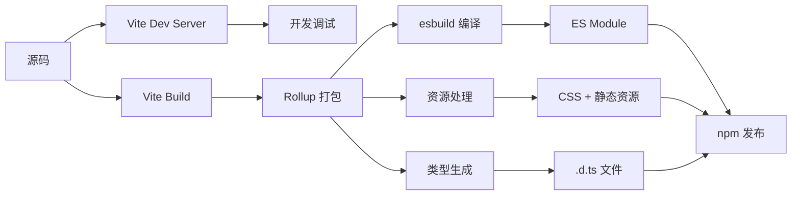

# Vite + Vue3 + TypeScript 组件库完整构建指南

> 从零到发布：基于 Vite 的现代化 Vue3 组件库开发全流程

---

## 📑 目录

1. [架构设计](#1-架构设计)
2. [技术选型](#2-技术选型)
3. [项目初始化](#3-项目初始化)
4. [目录结构设计](#4-目录结构设计)
5. [核心配置文件](#5-核心配置文件)
6. [组件开发规范](#6-组件开发规范)
7. [样式系统](#7-样式系统)
8. [资源处理](#8-资源处理)
9. [类型系统](#9-类型系统)
10. [构建打包](#10-构建打包)
11. [本地测试](#11-本地测试)
12. [发布流程](#12-发布流程)
13. [使用示例](#13-使用示例)

---

## 1. 架构设计

### 1.1 整体架构

```
┌─────────────────────────────────────────────┐
│              开发层 (Development)            │
│  - Vite Dev Server (HMR)                    │
│  - Vue 3 + TypeScript                        │
│  - Element Plus UI                           │
│  - SCSS 样式预处理                           │
└─────────────────────────────────────────────┘
                     ↓
┌─────────────────────────────────────────────┐
│              构建层 (Build)                  │
│  - Vite Library Mode                         │
│  - Rollup (内置)                             │
│  - esbuild (编译加速)                        │
│  - vite-plugin-dts (类型生成)                │
└─────────────────────────────────────────────┘
                     ↓
┌─────────────────────────────────────────────┐
│              产物层 (Output)                 │
│  - ES Module (支持 Tree-shaking)            │
│  - TypeScript 类型定义 (.d.ts)              │
│  - CSS 样式文件 (独立)                       │
│  - 静态资源 (优化后)                         │
└─────────────────────────────────────────────┘
                     ↓
┌─────────────────────────────────────────────┐
│              发布层 (Publish)                │
│  - npm Registry                              │
│  - 按需引入支持                               │
│  - 全量引入支持                               │
└─────────────────────────────────────────────┘
```

### 1.2 核心设计原则

| 原则 | 说明 | 实现方式 |
|------|------|---------|
| **按需加载** | 支持 Tree-shaking | ES Module + preserveModules |
| **类型安全** | 完整的 TypeScript 支持 | vite-plugin-dts |
| **样式独立** | CSS 可单独引入 | cssCodeSplit: true |
| **资源优化** | 图片/SVG 自动处理 | 内置 assetsInlineLimit |
| **开发体验** | 极速热更新 | Vite HMR |

### 1.3 构建流程



---

## 2. 技术选型

### 2.1 核心技术栈

| 技术 | 版本 | 用途 | 必选/可选 |
|------|------|------|---------|
| **Vite** | ^5.0.0 | 构建工具 | ✅ 必选 |
| **Vue** | ^3.4.0 | 核心框架 | ✅ 必选 |
| **TypeScript** | ^5.3.0 | 类型系统 | ✅ 必选 |
| **Element Plus** | ^2.5.0 | 基础 UI 库 | ✅ 必选 |
| **SCSS** | ^1.70.0 | 样式预处理 | ✅ 必选 |

### 2.2 构建插件

| 插件 | 版本 | 用途 |
|------|------|------|
| `@vitejs/plugin-vue` | ^5.0.0 | Vue 3 支持 |
| `vite-plugin-dts` | ^3.7.0 | 生成 .d.ts |
| `vite-svg-loader` | ^5.1.0 | SVG 组件化 |
| `unplugin-vue-components` | ^0.26.0 | 按需引入（可选）|

### 2.3 为什么选择这些技术？

**Vite vs Webpack**
```
Vite 优势：
  ✅ 开发启动快 10 倍
  ✅ 热更新快 20 倍
  ✅ 配置简单 80%
  ✅ 内置 TypeScript 支持
  ✅ 默认 ESM 输出
```

**为什么不需要 Rollup/Gulp/Webpack？**
```
Vite 已经内置：
  ✅ Rollup（构建时）
  ✅ esbuild（编译）
  ✅ PostCSS（样式处理）
  ✅ Terser（压缩）
```

---

## 3. 项目初始化

### 3.1 创建项目

```bash
# 创建项目目录
mkdir my-ui-library
cd my-ui-library

# 初始化 package.json
npm init -y

# 设置项目信息
```

### 3.2 安装核心依赖

```bash
# 核心框架
npm install vue@^3.4.0

# 开发依赖
npm install -D \
  vite@^5.0.0 \
  typescript@^5.3.0 \
  @vitejs/plugin-vue@^5.0.0 \
  vite-plugin-dts@^3.7.0 \
  sass@^1.70.0 \
  vite-svg-loader@^5.1.0

# Element Plus（按需）
npm install element-plus@^2.5.0

# TypeScript 类型
npm install -D \
  @types/node@^20.10.0 \
  vue-tsc@^1.8.27
```

### 3.3 package.json 基础配置

```json
{
  "name": "@yourscope/your-ui",
  "version": "1.0.0",
  "description": "基于 Vite + Vue3 的业务组件库",
  "type": "module",
  "main": "./dist/index.umd.js",
  "module": "./dist/index.es.js",
  "types": "./dist/index.d.ts",
  "exports": {
    ".": {
      "import": "./dist/index.es.js",
      "require": "./dist/index.umd.js",
      "types": "./dist/index.d.ts"
    },
    "./dist/style.css": "./dist/style.css",
    "./dist/*": "./dist/*"
  },
  "files": [
    "dist"
  ],
  "scripts": {
    "dev": "vite",
    "build": "vue-tsc && vite build",
    "preview": "vite preview"
  },
  "keywords": ["vue3", "component", "ui", "vite"],
  "author": "Your Name",
  "license": "MIT",
  "peerDependencies": {
    "vue": "^3.4.0"
  }
}
```

**关键字段说明**：

| 字段 | 作用 | 重要性 |
|------|------|--------|
| `type: "module"` | 声明为 ES Module | ⭐⭐⭐ |
| `main` | CommonJS 入口 | ⭐⭐⭐ |
| `module` | ES Module 入口 | ⭐⭐⭐ |
| `types` | TypeScript 类型入口 | ⭐⭐⭐ |
| `exports` | 现代化导出方式 | ⭐⭐⭐ |
| `files` | 发布包含的文件 | ⭐⭐⭐ |

---

## 4. 目录结构设计

### 4.1 完整目录树

```
my-ui-library/
├── packages/                    # 组件源码（核心）
│   ├── components/             # 业务组件
│   │   ├── MyButton/
│   │   │   ├── src/
│   │   │   │   └── MyButton.vue
│   │   │   ├── style/
│   │   │   │   └── index.scss
│   │   │   └── index.ts
│   │   ├── MyInput/
│   │   ├── MyTable/
│   │   └── index.ts            # 组件统一导出
│   ├── composables/            # 组合式函数
│   │   ├── useDialog.ts
│   │   └── index.ts
│   ├── utils/                  # 工具函数
│   │   ├── format.ts
│   │   └── index.ts
│   ├── types/                  # 类型定义
│   │   ├── component.ts
│   │   └── index.ts
│   ├── styles/                 # 全局样式
│   │   ├── variables.scss      # SCSS 变量
│   │   ├── mixins.scss         # SCSS 混入
│   │   └── index.scss          # 样式入口
│   ├── assets/                 # 静态资源
│   │   ├── images/
│   │   │   ├── logo.png
│   │   │   └── icon.svg
│   │   └── fonts/
│   └── index.ts                # 总入口
│
├── src/                        # 开发示例
│   ├── App.vue
│   ├── main.ts
│   └── examples/               # 组件示例
│       ├── ButtonDemo.vue
│       └── InputDemo.vue
│
├── dist/                       # 构建产物（自动生成）
│   ├── index.es.js             # ES Module
│   ├── index.umd.js            # UMD（可选）
│   ├── index.d.ts              # 类型定义
│   ├── style.css               # 样式
│   └── assets/                 # 静态资源
│       ├── images/
│       └── logo-[hash].png
│
├── vite.config.ts              # Vite 配置（核心）
├── tsconfig.json               # TypeScript 配置
├── tsconfig.build.json         # 构建用 TS 配置
├── package.json                # 项目配置
├── index.html                  # 开发入口
└── README.md                   # 说明文档
```

### 4.2 目录职责

| 目录 | 职责 | 是否提交 Git | 是否发布 npm |
|------|------|-------------|-------------|
| `packages/` | 组件库源码 | ✅ | ❌ |
| `src/` | 开发示例 | ✅ | ❌ |
| `dist/` | 构建产物 | ❌ | ✅ |
| `vite.config.ts` | 构建配置 | ✅ | ❌ |

---

## 5. 核心配置文件

### 5.1 Vite 配置（核心）

**vite.config.ts**

```typescript
import { defineConfig } from 'vite'
import vue from '@vitejs/plugin-vue'
import dts from 'vite-plugin-dts'
import svgLoader from 'vite-svg-loader'
import { resolve } from 'path'

export default defineConfig({
  plugins: [
    vue(),
    
    // 生成 TypeScript 类型定义
    dts({
      include: ['packages/**/*'],
      exclude: ['src/**/*', 'node_modules'],
      outDir: 'dist',
      // 生成单独的类型入口文件
      insertTypesEntry: true,
      // 复制 .vue 文件的类型
      copyDtsFiles: true,
      // 静态类型检查
      staticImport: true,
      // 跳过诊断（加快速度）
      skipDiagnostics: false,
      // 输出诊断信息
      logDiagnostics: true
    }),
    
    // SVG 作为 Vue 组件导入
    svgLoader({
      svgoConfig: {
        multipass: true,
        plugins: [
          {
            name: 'preset-default',
            params: {
              overrides: {
                removeViewBox: false
              }
            }
          }
        ]
      }
    })
  ],
  
  // 开发服务器配置
  server: {
    port: 3000,
    open: true
  },
  
  // 路径解析
  resolve: {
    alias: {
      '@': resolve(__dirname, 'packages')
    }
  },
  
  // CSS 配置
  css: {
    preprocessorOptions: {
      scss: {
        // 全局引入变量和混入
        additionalData: `
          @import "@/styles/variables.scss";
          @import "@/styles/mixins.scss";
        `
      }
    }
  },
  
  // 构建配置（核心）
  build: {
    lib: {
      // 入口文件
      entry: resolve(__dirname, 'packages/index.ts'),
      // 库名称（UMD 格式使用）
      name: 'MyUILibrary',
      // 输出文件名
      fileName: (format) => `index.${format}.js`,
      // 输出格式
      formats: ['es', 'umd']
    },
    
    rollupOptions: {
      // 外部依赖（不打包进组件库）
      external: [
        'vue',
        'element-plus',
        /^element-plus\/.*/
      ],
      
      output: {
        // 全局变量名（UMD 格式）
        globals: {
          vue: 'Vue',
          'element-plus': 'ElementPlus'
        },
        
        // 保留模块结构（重要：支持按需引入）
        preserveModules: true,
        preserveModulesRoot: 'packages',
        
        // 输出目录
        dir: 'dist',
        
        // 导出模式
        exports: 'named',
        
        // 静态资源命名
        assetFileNames: (assetInfo) => {
          // CSS 文件
          if (assetInfo.name === 'style.css') {
            return 'style.css'
          }
          // 图片资源
          if (/\.(png|jpe?g|gif|svg|webp)$/.test(assetInfo.name || '')) {
            return 'assets/images/[name]-[hash][extname]'
          }
          // 字体资源
          if (/\.(woff2?|eot|ttf|otf)$/.test(assetInfo.name || '')) {
            return 'assets/fonts/[name]-[hash][extname]'
          }
          return 'assets/[name]-[hash][extname]'
        }
      }
    },
    
    // 输出目录
    outDir: 'dist',
    
    // 清空输出目录
    emptyOutDir: true,
    
    // CSS 代码分割
    cssCodeSplit: true,
    
    // 压缩配置
    minify: 'esbuild',
    
    // 静态资源内联阈值（小于此值转 base64）
    assetsInlineLimit: 4096, // 4KB
    
    // Source Map
    sourcemap: false,
    
    // 目标环境
    target: 'es2015',
    
    // 库模式不需要 polyfill
    cssTarget: 'chrome61'
  }
})
```

**配置详解**：

| 配置项 | 作用 | 关键点 |
|--------|------|--------|
| `preserveModules: true` | 保持模块结构 | 支持按需引入 |
| `external` | 外部依赖 | 不打包 Vue/Element Plus |
| `assetsInlineLimit` | 小资源内联 | < 4KB 转 base64 |
| `cssCodeSplit` | CSS 分割 | 每个组件独立 CSS |
| `formats: ['es', 'umd']` | 输出格式 | ES Module + UMD |

---

### 5.2 TypeScript 配置

**tsconfig.json**（开发用）

```json
{
  "compilerOptions": {
    "target": "ES2020",
    "useDefineForClassFields": true,
    "module": "ESNext",
    "lib": ["ES2020", "DOM", "DOM.Iterable"],
    "skipLibCheck": true,

    /* 模块解析 */
    "moduleResolution": "bundler",
    "allowImportingTsExtensions": true,
    "resolveJsonModule": true,
    "isolatedModules": true,
    "noEmit": true,
    "jsx": "preserve",

    /* 类型检查 */
    "strict": true,
    "noUnusedLocals": true,
    "noUnusedParameters": true,
    "noFallthroughCasesInSwitch": true,

    /* 路径映射 */
    "baseUrl": ".",
    "paths": {
      "@/*": ["packages/*"]
    }
  },
  "include": [
    "src/**/*",
    "packages/**/*",
    "vite.config.ts"
  ],
  "exclude": [
    "node_modules",
    "dist"
  ]
}
```

**tsconfig.build.json**（构建用）

```json
{
  "extends": "./tsconfig.json",
  "compilerOptions": {
    "declaration": true,
    "declarationMap": true,
    "emitDeclarationOnly": true,
    "outDir": "dist"
  },
  "include": [
    "packages/**/*"
  ],
  "exclude": [
    "node_modules",
    "dist",
    "src",
    "**/*.spec.ts"
  ]
}
```

---

### 5.3 环境类型声明

**env.d.ts**

```typescript
/// <reference types="vite/client" />

// Vue 文件类型
declare module '*.vue' {
  import type { DefineComponent } from 'vue'
  const component: DefineComponent<{}, {}, any>
  export default component
}

// SVG 作为组件导入
declare module '*.svg' {
  import type { DefineComponent } from 'vue'
  const component: DefineComponent
  export default component
}

// SVG 作为 URL 导入
declare module '*.svg?url' {
  const content: string
  export default content
}

// 图片资源
declare module '*.png' {
  const content: string
  export default content
}

declare module '*.jpg' {
  const content: string
  export default content
}

declare module '*.jpeg' {
  const content: string
  export default content
}

declare module '*.gif' {
  const content: string
  export default content
}

declare module '*.webp' {
  const content: string
  export default content
}

// SCSS 模块
declare module '*.scss' {
  const content: Record<string, string>
  export default content
}

// SCSS 全局变量
declare module '@/styles/variables.scss' {
  export const primaryColor: string
  export const successColor: string
  // ... 其他变量
}
```

---

## 6. 组件开发规范

### 6.1 组件目录结构

```
packages/components/MyButton/
├── src/
│   ├── MyButton.vue            # 组件实现
│   └── types.ts                # 组件类型
├── style/
│   └── index.scss              # 组件样式
└── index.ts                    # 组件入口
```

### 6.2 组件实现示例

**MyButton.vue**

```vue
<template>
  <el-button
    :class="['my-button', `my-button--${type}`]"
    :size="size"
    :disabled="disabled"
    :loading="loading"
    @click="handleClick"
  >
    <slot>{{ text }}</slot>
  </el-button>
</template>

<script setup lang="ts">
import { computed } from 'vue'
import type { MyButtonProps, MyButtonEmits } from './types'

// 定义组件名称
defineOptions({
  name: 'MyButton'
})

// Props
const props = withDefaults(defineProps<MyButtonProps>(), {
  type: 'primary',
  size: 'default',
  disabled: false,
  loading: false,
  text: ''
})

// Emits
const emit = defineEmits<MyButtonEmits>()

// 计算属性
const buttonClass = computed(() => {
  return [
    'my-button',
    `my-button--${props.type}`,
    {
      'is-disabled': props.disabled,
      'is-loading': props.loading
    }
  ]
})

// 事件处理
const handleClick = (event: MouseEvent) => {
  if (props.disabled || props.loading) return
  emit('click', event)
}
</script>

<style scoped lang="scss">
@import '../style/index.scss';
</style>
```

**types.ts**

```typescript
export interface MyButtonProps {
  type?: 'primary' | 'success' | 'warning' | 'danger' | 'info'
  size?: 'large' | 'default' | 'small'
  disabled?: boolean
  loading?: boolean
  text?: string
}

export interface MyButtonEmits {
  (e: 'click', event: MouseEvent): void
}
```

**style/index.scss**

```scss
.my-button {
  // 基础样式
  display: inline-flex;
  align-items: center;
  justify-content: center;
  padding: 0 16px;
  height: 32px;
  border-radius: 4px;
  cursor: pointer;
  transition: all 0.3s;
  
  // 类型样式
  &--primary {
    background-color: var(--el-color-primary);
    color: #fff;
    
    &:hover {
      background-color: var(--el-color-primary-light-3);
    }
  }
  
  // 禁用状态
  &.is-disabled {
    cursor: not-allowed;
    opacity: 0.6;
  }
  
  // 加载状态
  &.is-loading {
    cursor: wait;
  }
}
```

**index.ts**（组件入口）

```typescript
import { App } from 'vue'
import MyButton from './src/MyButton.vue'

// 为组件添加 install 方法
MyButton.install = function (app: App) {
  app.component(MyButton.name!, MyButton)
}

export default MyButton
export * from './src/types'
```

---

### 6.3 组件统一导出

**packages/components/index.ts**

```typescript
import type { App } from 'vue'
import MyButton from './MyButton'
import MyInput from './MyInput'
import MyTable from './MyTable'
// ... 导入其他组件

// 组件列表
const components = [
  MyButton,
  MyInput,
  MyTable
  // ... 其他组件
]

// 全局安装方法
const install = (app: App): void => {
  components.forEach(component => {
    app.use(component)
  })
}

// 按需导出
export {
  install,
  MyButton,
  MyInput,
  MyTable
  // ... 其他组件
}

// 默认导出（支持 app.use(MyUI)）
export default {
  install
}
```

---

### 6.4 总入口

**packages/index.ts**

```typescript
// 组件
export * from './components'
export { default } from './components'

// 工具函数
export * from './utils'

// 组合式函数
export * from './composables'

// 类型
export * from './types'

// 样式（用户可选择性导入）
import './styles/index.scss'
```

---

## 7. 样式系统

### 7.1 样式目录结构

```
packages/styles/
├── variables.scss              # SCSS 变量
├── mixins.scss                 # SCSS 混入
├── reset.scss                  # 样式重置
├── common.scss                 # 公共样式
└── index.scss                  # 样式入口
```

### 7.2 SCSS 变量

**variables.scss**

```scss
// 颜色系统
$primary-color: #409EFF !default;
$success-color: #67C23A !default;
$warning-color: #E6A23C !default;
$danger-color: #F56C6C !default;
$info-color: #909399 !default;

// 字体
$font-family: 'Helvetica Neue', Helvetica, 'PingFang SC', 'Hiragino Sans GB',
  'Microsoft YaHei', '微软雅黑', Arial, sans-serif !default;
$font-size-base: 14px !default;
$font-size-small: 12px !default;
$font-size-large: 16px !default;

// 间距
$spacing-base: 16px !default;
$spacing-small: 8px !default;
$spacing-large: 24px !default;

// 圆角
$border-radius-base: 4px !default;
$border-radius-small: 2px !default;
$border-radius-large: 8px !default;

// 阴影
$box-shadow-base: 0 2px 12px 0 rgba(0, 0, 0, 0.1) !default;
$box-shadow-light: 0 2px 4px 0 rgba(0, 0, 0, 0.12) !default;

// 过渡
$transition-base: all 0.3s cubic-bezier(0.645, 0.045, 0.355, 1) !default;

// 层级
$z-index-base: 1000 !default;
$z-index-modal: 2000 !default;
$z-index-dropdown: 3000 !default;
```

### 7.3 SCSS 混入

**mixins.scss**

```scss
// 清除浮动
@mixin clearfix {
  &::after {
    content: '';
    display: table;
    clear: both;
  }
}

// 文字省略
@mixin ellipsis {
  overflow: hidden;
  text-overflow: ellipsis;
  white-space: nowrap;
}

// 多行省略
@mixin multi-ellipsis($lines: 2) {
  display: -webkit-box;
  -webkit-line-clamp: $lines;
  -webkit-box-orient: vertical;
  overflow: hidden;
  text-overflow: ellipsis;
}

// Flex 居中
@mixin flex-center {
  display: flex;
  align-items: center;
  justify-content: center;
}

// 响应式断点
@mixin respond-to($breakpoint) {
  @if $breakpoint == 'mobile' {
    @media (max-width: 768px) {
      @content;
    }
  } @else if $breakpoint == 'tablet' {
    @media (min-width: 769px) and (max-width: 1024px) {
      @content;
    }
  } @else if $breakpoint == 'desktop' {
    @media (min-width: 1025px) {
      @content;
    }
  }
}

// 按钮基础样式
@mixin button-base {
  display: inline-flex;
  align-items: center;
  justify-content: center;
  padding: 0 $spacing-base;
  border: 1px solid transparent;
  border-radius: $border-radius-base;
  font-size: $font-size-base;
  cursor: pointer;
  transition: $transition-base;
  user-select: none;
  
  &:focus {
    outline: none;
  }
  
  &:disabled {
    cursor: not-allowed;
    opacity: 0.6;
  }
}
```

### 7.4 样式入口

**index.scss**

```scss
// 引入变量和混入（已在 vite.config.ts 全局引入）
// @import './variables.scss';
// @import './mixins.scss';

// 样式重置
@import './reset.scss';

// 公共样式
@import './common.scss';
```

---

## 8. 资源处理

### 8.1 图片处理策略

```typescript
// vite.config.ts 中的配置
{
  build: {
    // 小于 4KB 的图片转 base64
    assetsInlineLimit: 4096,
    
    rollupOptions: {
      output: {
        assetFileNames: (assetInfo) => {
          // 图片资源
          if (/\.(png|jpe?g|gif|svg|webp)$/.test(assetInfo.name || '')) {
            return 'assets/images/[name]-[hash][extname]'
          }
          return 'assets/[name]-[hash][extname]'
        }
      }
    }
  }
}
```

### 8.2 图片使用方式

**方式一：作为模块导入**

```vue
<script setup lang="ts">
import logo from '@/assets/images/logo.png'
</script>

<template>
  
</template>
```

**方式二：动态导入**

```vue
<script setup lang="ts">
import { ref } from 'vue'

const getImageUrl = (name: string) => {
  return new URL(`../assets/images/${name}`, import.meta.url).href
}

const imageSrc = ref(getImageUrl('logo.png'))
</script>

<template>
  
</template>
```

---

### 8.3 SVG 处理

**方式一：作为 Vue 组件**

```vue
<script setup lang="ts">
import IconUser from '@/assets/icons/user.svg'
</script>

<template>
  <IconUser class="icon" />
</template>
```

**方式二：作为 URL**

```vue
<script setup lang="ts">
import iconUrl from '@/assets/icons/user.svg?url'
</script>

<template>
  
</template>
```

---

### 8.4 资源类型声明

**packages/types/assets.d.ts**

```typescript
// 图片资源
declare module '*.png' {
  const src: string
  export default src
}

declare module '*.jpg' {
  const src: string
  export default src
}

declare module '*.jpeg' {
  const src: string
  export default src
}

declare module '*.gif' {
  const src: string
  export default src
}

declare module '*.webp' {
  const src: string
  export default src
}

// SVG 作为组件
declare module '*.svg' {
  import type { DefineComponent } from 'vue'
  const component: DefineComponent
  export default component
}

// SVG 作为 URL
declare module '*.svg?url' {
  const src: string
  export default src
}
```

---

## 9. 类型系统

### 9.1 全局类型定义

**packages/types/index.ts**

```typescript
import type { App } from 'vue'

// 组件安装接口
export interface InstallableComponent {
  install(app: App): void
}

// 组件大小
export type ComponentSize = 'large' | 'default' | 'small'

// 组件状态
export type ComponentStatus = 'success' | 'warning' | 'danger' | 'info'

// 公共 Props
export interface CommonProps {
  size?: ComponentSize
  disabled?: boolean
  loading?: boolean
}

// 分页
export interface Pagination {
  page: number
  pageSize: number
  total: number
}

// 表格列
export interface TableColumn<T = any> {
  prop: keyof T
  label: string
  width?: string | number
  minWidth?: string | number
  align?: 'left' | 'center' | 'right'
  fixed?: 'left' | 'right'
  sortable?: boolean
  formatter?: (row: T, column: TableColumn<T>, cellValue: any) => string
}

// 表单规则
export interface FormRule {
  required?: boolean
  message?: string
  trigger?: 'blur' | 'change'
  min?: number
  max?: number
  pattern?: RegExp
  validator?: (rule: FormRule, value: any, callback: Function) => void
}
```

### 9.2 组件类型导出

**packages/components/MyButton/src/types.ts**

```typescript
export interface MyButtonProps {
  type?: 'primary' | 'success' | 'warning' | 'danger' | 'info'
  size?: 'large' | 'default' | 'small'
  disabled?: boolean
  loading?: boolean
  text?: string
  icon?: string
  round?: boolean
  circle?: boolean
}

export interface MyButtonEmits {
  (e: 'click', event: MouseEvent): void
}

export interface MyButtonSlots {
  default?: () => any
  icon?: () => any
}
```

---

## 10. 构建打包

### 10.1 构建命令

```json
{
  "scripts": {
    "dev": "vite",
    "build": "vue-tsc && vite build",
    "build:watch": "vite build --watch",
    "preview": "vite preview"
  }
}
```

### 10.2 构建流程

```bash
# 1. 类型检查
vue-tsc

# 2. Vite 构建
vite build
  ↓
# 3. Rollup 打包
  ├─ preserveModules（保持模块结构）
  ├─ 处理外部依赖（external）
  ├─ 编译 TypeScript（esbuild）
  ├─ 处理 Vue 文件
  ├─ 处理 SCSS
  ├─ 处理静态资源
  └─ 生成类型定义（vite-plugin-dts）
  ↓
# 4. 输出到 dist/
dist/
├── index.es.js           # ES Module
├── index.umd.js          # UMD（可选）
├── index.d.ts            # 类型定义入口
├── style.css             # 样式
├── components/           # 各组件（按需引入支持）
│   ├── MyButton/
│   │   ├── index.js
│   │   ├── index.d.ts
│   │   └── style.css
│   └── MyInput/
└── assets/               # 静态资源
    └── images/
```

### 10.3 构建优化

**package.json**

```json
{
  "scripts": {
    "build": "vue-tsc && vite build",
    "build:fast": "vite build",
    "build:analyze": "vite build --mode analyze"
  }
}
```

**vite.config.ts 分析模式**

```typescript
import { defineConfig } from 'vite'
import { visualizer } from 'rollup-plugin-visualizer'

export default defineConfig(({ mode }) => ({
  plugins: [
    // ... 其他插件
    mode === 'analyze' && visualizer({
      open: true,
      gzipSize: true,
      brotliSize: true
    })
  ]
}))
```

---

## 11. 本地测试

### 11.1 npm link 测试

```bash
# 在组件库项目中
npm run build
npm link

# 在测试项目中
npm link @yourscope/your-ui
```

**测试项目使用**：

```vue
<script setup lang="ts">
import { MyButton, MyInput } from '@yourscope/your-ui'
import '@yourscope/your-ui/dist/style.css'
</script>

<template>
  <MyButton @click="handleClick">按钮</MyButton>
  <MyInput v-model="value" />
</template>
```

### 11.2 本地包测试

```bash
# 打包成 tgz
npm pack

# 在测试项目中安装
npm install ../my-ui-library/yourscope-your-ui-1.0.0.tgz
```

### 11.3 Verdaccio 本地 npm 服务

```bash
# 安装 Verdaccio
npm install -g verdaccio

# 启动本地 npm 服务
verdaccio

# 指向本地服务
npm set registry http://localhost:4873

# 发布到本地
npm publish

# 测试项目安装
npm install @yourscope/your-ui
```

---

## 12. 发布流程

### 12.1 发布前检查清单

- [ ] 代码通过 TypeScript 检查
- [ ] 构建成功
- [ ] package.json 信息正确
- [ ] README.md 完整
- [ ] LICENSE 文件存在
- [ ] .gitignore 配置正确
- [ ] .npmignore 或 files 字段配置正确

### 12.2 版本管理

```bash
# 修改版本号
npm version patch   # 1.0.0 -> 1.0.1
npm version minor   # 1.0.0 -> 1.1.0
npm version major   # 1.0.0 -> 2.0.0

# 预发布版本
npm version prerelease --preid=beta  # 1.0.0 -> 1.0.1-beta.0
```

### 12.3 发布到 npm

```bash
# 1. 登录 npm
npm login

# 2. 构建
npm run build

# 3. 发布
npm publish --access public

# 4. 查看发布结果
npm view @yourscope/your-ui
```

### 12.4 .npmignore

```
# 源码
src/
packages/

# 配置文件
vite.config.ts
tsconfig*.json
.eslintrc*
.prettierrc*

# 开发文件
*.md
!README.md
.gitignore
.editorconfig

# 依赖
node_modules/
```

### 12.5 发布脚本

**package.json**

```json
{
  "scripts": {
    "prepublishOnly": "npm run build",
    "release": "npm run build && npm publish --access public"
  }
}
```

---

## 13. 使用示例

### 13.1 全量引入

```typescript
// main.ts
import { createApp } from 'vue'
import App from './App.vue'
import MyUI from '@yourscope/your-ui'
import '@yourscope/your-ui/dist/style.css'

const app = createApp(App)
app.use(MyUI)
app.mount('#app')
```

### 13.2 按需引入（手动）

```vue
<script setup lang="ts">
import { MyButton, MyInput } from '@yourscope/your-ui'
import '@yourscope/your-ui/dist/components/MyButton/style.css'
import '@yourscope/your-ui/dist/components/MyInput/style.css'
</script>

<template>
  <MyButton>按钮</MyButton>
  <MyInput v-model="value" />
</template>
```

### 13.3 按需引入（自动）

**安装插件**：

```bash
npm install -D unplugin-vue-components unplugin-auto-import
```

**vite.config.ts**（用户项目）

```typescript
import { defineConfig } from 'vite'
import Components from 'unplugin-vue-components/vite'
import AutoImport from 'unplugin-auto-import/vite'

export default defineConfig({
  plugins: [
    AutoImport({
      resolvers: [
        // 自定义解析器
        (name) => {
          if (name.startsWith('My')) {
            return {
              name,
              from: '@yourscope/your-ui'
            }
          }
        }
      ]
    }),
    Components({
      resolvers: [
        (name) => {
          if (name.startsWith('My')) {
            return {
              name,
              from: '@yourscope/your-ui',
              sideEffects: `@yourscope/your-ui/dist/components/${name}/style.css`
            }
          }
        }
      ]
    })
  ]
})
```

**使用（无需 import）**：

```vue
<template>
  <!-- 自动引入 -->
  <MyButton>按钮</MyButton>
  <MyInput v-model="value" />
</template>
```

---

## 14. 完整实施步骤

### Step 1: 初始化项目（10 分钟）

```bash
# 1. 创建项目目录
mkdir my-ui-library && cd my-ui-library

# 2. 初始化 package.json
npm init -y

# 3. 安装依赖
npm install vue@^3.4.0
npm install -D vite@^5.0.0 typescript@^5.3.0 @vitejs/plugin-vue@^5.0.0 \
  vite-plugin-dts@^3.7.0 sass@^1.70.0 vite-svg-loader@^5.1.0 \
  @types/node@^20.10.0 vue-tsc@^1.8.27
npm install element-plus@^2.5.0

# 4. 创建目录结构
mkdir -p packages/{components,composables,utils,types,styles,assets}
mkdir -p src/examples
```

### Step 2: 创建配置文件（20 分钟）

1. 复制上面的 `vite.config.ts`
2. 复制上面的 `tsconfig.json`
3. 复制上面的 `tsconfig.build.json`
4. 创建 `env.d.ts`
5. 更新 `package.json`

### Step 3: 创建第一个组件（30 分钟）

1. 创建 `packages/components/MyButton` 目录
2. 实现 `MyButton.vue`
3. 创建 `types.ts`
4. 创建 `style/index.scss`
5. 创建 `index.ts`

### Step 4: 创建样式系统（20 分钟）

1. 创建 `packages/styles/variables.scss`
2. 创建 `packages/styles/mixins.scss`
3. 创建 `packages/styles/index.scss`

### Step 5: 创建入口文件（10 分钟）

1. 创建 `packages/components/index.ts`
2. 创建 `packages/index.ts`

### Step 6: 开发调试（20 分钟）

1. 创建 `index.html`
2. 创建 `src/main.ts`
3. 创建 `src/App.vue`
4. 运行 `npm run dev`

### Step 7: 构建测试（10 分钟）

```bash
npm run build
# 检查 dist/ 目录
```

### Step 8: 本地测试（15 分钟）

```bash
npm link
# 在测试项目中 npm link @yourscope/your-ui
```

### Step 9: 发布（10 分钟）

```bash
npm login
npm publish --access public
```

**总计：约 2.5 小时**

---

## 15. 常见问题

### Q1: 类型定义没有生成？

**解决**：
```bash
# 确保安装了 vite-plugin-dts
npm install -D vite-plugin-dts

# 检查 tsconfig.build.json
"declaration": true
```

### Q2: 样式没有打包进来？

**解决**：
```typescript
// vite.config.ts
{
  build: {
    cssCodeSplit: true  // 确保为 true
  }
}
```

### Q3: 图片路径错误？

**解决**：
```typescript
// 使用 new URL 方式导入
const imageUrl = new URL('../assets/logo.png', import.meta.url).href
```

### Q4: Element Plus 样式丢失？

**解决**：
```typescript
// 用户项目需要导入
import 'element-plus/dist/index.css'
```

### Q5: 按需引入不生效？

**解决**：
```typescript
// vite.config.ts 确保
{
  build: {
    rollupOptions: {
      output: {
        preserveModules: true  // 必须为 true
      }
    }
  }
}
```

---

## 16. 最佳实践

### 16.1 组件设计原则

1. **单一职责**：一个组件只做一件事
2. **Props 设计**：提供合理的默认值
3. **事件命名**：使用语义化的事件名
4. **插槽设计**：提供灵活的内容定制
5. **样式隔离**：使用 scoped 或 CSS Modules

### 16.2 性能优化

1. **按需引入**：保持 `preserveModules: true`
2. **代码分割**：大组件拆分子组件
3. **资源优化**：图片压缩、SVG 优化
4. **Tree-shaking**：避免副作用导入

### 16.3 文档规范

1. **README**：清晰的安装和使用说明
2. **CHANGELOG**：记录版本变更
3. **组件文档**：Props、Events、Slots 说明
4. **TypeScript**：完整的类型定义

---

## 17. 参考资源

- [Vite 官方文档](https://vitejs.dev/)
- [Vue 3 官方文档](https://vuejs.org/)
- [Element Plus 官方文档](https://element-plus.org/)
- [vite-plugin-dts](https://github.com/qmhc/vite-plugin-dts)
- [unplugin-vue-components](https://github.com/antfu/unplugin-vue-components)

---

## 18. 附录

### 18.1 完整的 package.json

```json
{
  "name": "@yourscope/your-ui",
  "version": "1.0.0",
  "description": "基于 Vite + Vue3 的业务组件库",
  "type": "module",
  "main": "./dist/index.umd.js",
  "module": "./dist/index.es.js",
  "types": "./dist/index.d.ts",
  "exports": {
    ".": {
      "import": "./dist/index.es.js",
      "require": "./dist/index.umd.js",
      "types": "./dist/index.d.ts"
    },
    "./dist/style.css": "./dist/style.css",
    "./dist/*": "./dist/*"
  },
  "files": [
    "dist"
  ],
  "scripts": {
    "dev": "vite",
    "build": "vue-tsc && vite build",
    "preview": "vite preview",
    "prepublishOnly": "npm run build"
  },
  "keywords": ["vue3", "component", "ui", "vite", "typescript"],
  "author": "Your Name",
  "license": "MIT",
  "peerDependencies": {
    "vue": "^3.4.0"
  },
  "dependencies": {
    "element-plus": "^2.5.0"
  },
  "devDependencies": {
    "@types/node": "^20.10.0",
    "@vitejs/plugin-vue": "^5.0.0",
    "sass": "^1.70.0",
    "typescript": "^5.3.0",
    "vite": "^5.0.0",
    "vite-plugin-dts": "^3.7.0",
    "vite-svg-loader": "^5.1.0",
    "vue": "^3.4.0",
    "vue-tsc": "^1.8.27"
  }
}
```

---

**🎉 恭喜！按照本文档，你将成功构建并发布自己的 Vue3 组件库！**
